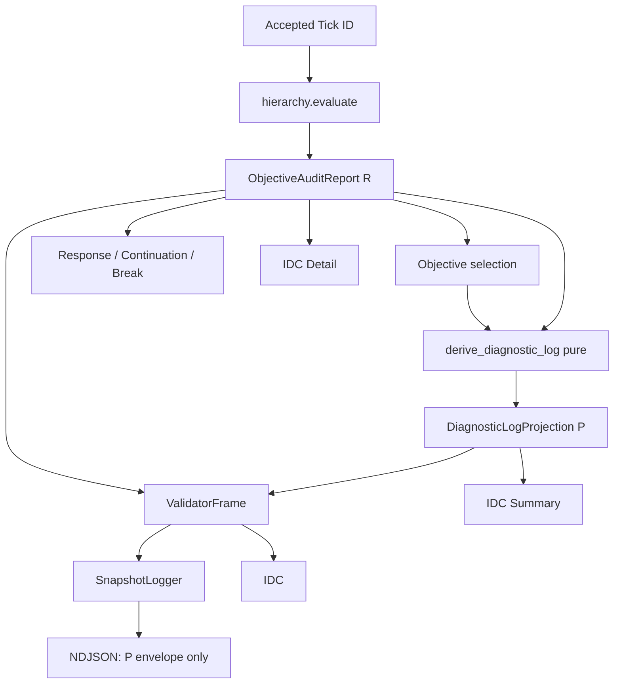

# Sprint H-6.9.4 — Alternative E Certification Report

**Result: PASS**  
**Contract:** `docs/H693_DIAGNOSTIC_REPRESENTATION_CERTIFICATION_PLAN.md` (FROZEN / READY)  
**Suite:** 588 passed (full `pytest`)  
**Performance Gate:** PASS

---

## Architecture

### Old flow (pre–Alternative E)

```
Hierarchy.evaluate → R (ObjectiveAuditReport)
ObjectiveEngine selects from R
ValidatorFrame.objective_diagnostics = R
SnapshotLogger → _jsonable(full frame including R highs[]/lows[])
IDC → reads R (and previously risked re-evaluate)
```

Logger paid H-6.9.1 cost: recursive `_jsonable` of full `SwingDiagnostic` collections.

### New flow (Alternative E)

```
Hierarchy.evaluate → R
ObjectiveEngine / Response / Continuation / Break / Checkpoint  → use R only
derive_diagnostic_log(R, objective) → P   # pure, ≤1 per accepted Tick ID
ValidatorFrame:
    objective_diagnostics = R
    diagnostic_log        = P
SnapshotLogger → serialize P envelope only
                 (diagnostic_log_version + diagnostic_log)
                 never R, never full highs/lows
IDC summary → P
IDC detail  → R from latest frame
              never hierarchy.evaluate()
```



---

## Certification matrix (H-6.9.3 areas)

| # | Area | Result |
|---|------|--------|
| 1 | Runtime correctness | **PASS** |
| 2 | Selection correctness | **PASS** (selection uses R identity; P never typed as report) |
| 3 | Checkpoint correctness | **PASS** (T2 replay identical version/journal) |
| 4 | Logger correctness | **PASS** (schema v1; no R / no full highs/lows) |
| 5 | IDC correctness | **PASS** (summary←P, detail←R; zero evaluate on render) |
| 6 | Projection correctness | **PASS** (pure; `id(R)` / FP-R stable; FP-P≡FP-S; FP-R≢FP-P) |

**Overall: PASS**

---

## Regression matrix T1–T14

| ID | Test | Result |
|----|------|--------|
| T1 | Golden engine outputs | **PASS** |
| T2 | Checkpoint/journal identical | **PASS** |
| T3 | Live replay logger schema | **PASS** |
| T4 | Stress ≥500 ticks | **PASS** |
| T5 | Large collections omit full arrays | **PASS** |
| T6 | Empty collections | **PASS** |
| T7 | Challenge transitions / challenged_count | **PASS** |
| T8 | One-way projection probe | **PASS** |
| T9 | No second evaluate (+logger+IDC) | **PASS** |
| T10 | Logger forbidden-field scan | **PASS** |
| T11 | FP-P == FP-S | **PASS** |
| T12 | FP-R pre == FP-R post | **PASS** |
| T13 | IDC render probe | **PASS** |
| T14 | Schema version gate | **PASS** |

Harness: `tests/live_validator/test_h694_alternative_e.py`

---

## Performance table (25H+25L fixture)

Agreed tolerances:

- Snapshot Logger after ≤ before × 1.05  
- Projection mean < 2.0 ms  
- P payload bytes ≤ 50% of R bytes  

| Metric | Before (R path) | After (P path) | Delta |
|--------|-----------------|----------------|-------|
| Loop Time (no logger) | 0.863 ms | — | baseline (includes derive) |
| Loop Time (with logger) | — | 0.915 ms | +0.052 ms vs no-logger |
| Snapshot Logger | 0.415 ms | 0.264 ms | **−36%** (1.57× faster) |
| Checkpoint | unchanged path | unchanged path | no design change |
| Memory (tracemalloc peak serialize) | 26 232 B | 2 968 B | **−89%** |
| Projection creation | — | 0.010 ms | ≪ 2.0 ms gate |
| R serialize | 0.397 ms / 27 026 B | — | hotspot removed from logger |
| P serialize | — | 0.015 ms / 2 559 B | **9.5% of R bytes** |

**Performance Gate: PASS** (no runtime regression beyond tolerance; logger improved)

---

## Regression summary

| Surface | Change |
|---------|--------|
| Hierarchy / Objective / Response / Continuation / Break | **None** (behavior unchanged) |
| Max `hierarchy.evaluate` / Tick ID | Still **1** (H-6.8.2) |
| ValidatorFrame | Added `diagnostic_log` (P); kept `objective_diagnostics` (R) |
| SnapshotLogger | Serializes P envelope only |
| IDC Objective page | Summary from P; detail from R |
| Hard fail conditions (§7 H-6.9.3) | None triggered |

---

## Files (this sprint)

- `src/hotirjam_ai5/live_validator/diagnostic_projection.py` — P model + pure derive + schema validator  
- `src/hotirjam_ai5/live_validator/models.py` — frame fields R+P  
- `src/hotirjam_ai5/live_validator/pipeline.py` — one derive per evaluate  
- `src/hotirjam_ai5/live_validator/logger.py` — serialize P only  
- `src/hotirjam_ai5/live_validator/idc_objective.py` — summary←P / detail←R  
- `tests/live_validator/test_h694_alternative_e.py` — T1–T14 + perf gate  
